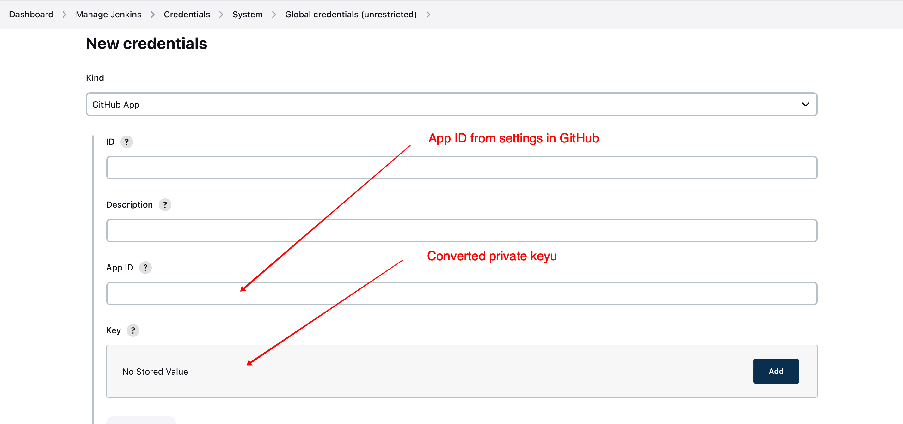
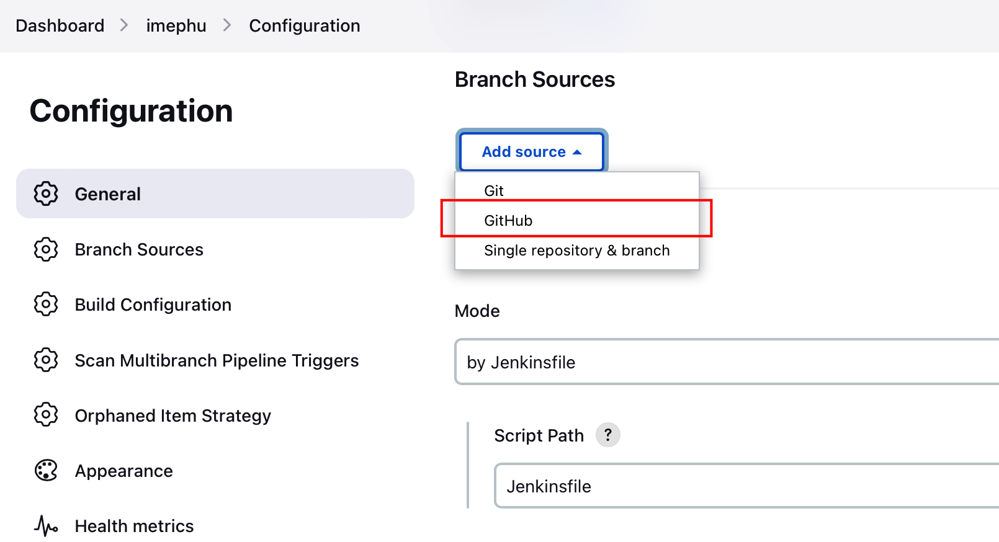
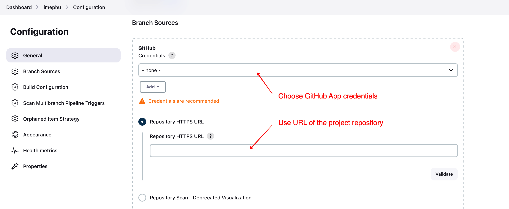
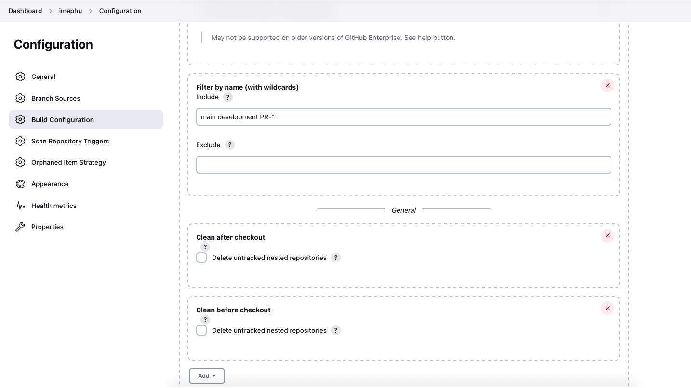
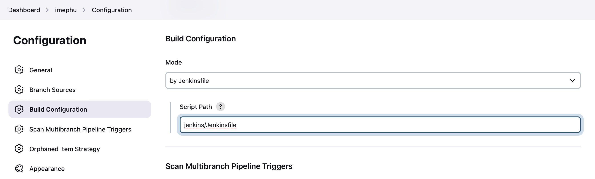
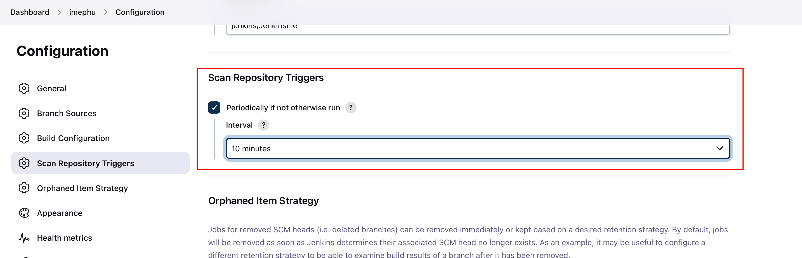

# Setting up the Jenkins CI/CD workflow

## Tunneling through a firewall

In case your Jenkins server is behind a firewall, you may use [ngrok](https://ngrok.io) to allow the use of GitHub webhooks. See [this video](https://youtu.be/yMNJeWeE0qI) for a walk-through. ngrok lets you create a permanent domain, and you can specify it when creating the tunnel:

```bash
ngrok http --domain your.permanent.domain 8080
```

`your.permanent.domain` and `8080` need to be replaced with your domain and your Jenkins server's port, respectively.

## Prerequisites

### GitHub App

Before setting up the Jenkins job you need to create a GitHub App, install it in your repository, and add credentials (of type "GitHub App") for it in Jenkins. An explanation is given in [this video](https://youtu.be/aDmeeVDrp0o) and on [this webpage](https://docs.cloudbees.com/docs/cloudbees-ci/latest/cloud-admin-guide/github-app-auth). When creating the app, you are asked to generate a private key. This key will automatically be downloaded. Note that, as mentioned in these resources, you need to convert the downloaded key with a command like

```bash
openssl pkcs8 -topk8 -inform PEM -outform PEM -in downloaded-github-app-key.pem -out converted-github-app-key.pem -nocrypt
```

You need to create credentials of type "GitHub App" for this GitHub App. The App ID is an integer, which you can find on the General tab of the app's settings. The Key is the converted private key you generated above.



### Remote servers

The workflow connects via SSH to the development and the production server. This requires that a public SSH key is stored in the `authorized_keys` file of the user on these servers and that the corresponding private key is stored along with the username in the Jenkins credentials. See [this Stack Overflow entry](https://stackoverflow.com/questions/37331571/how-to-setup-ssh-keys-for-jenkins-to-publish-via-ssh) for more details.

### Environment variables

The following environment variable needs to be defined.

| Environment variable | Description                                                                           | Example value        |
|----------------------|---------------------------------------------------------------------------------------|----------------------|
| SALT_ASTROOPS_EMAIL  | Email address for SALT Astronomy Operations. This is used for pipeline notifications. | astroops@example.com |

Environment variables can be set via Manage Jenkins - Configure System (cf. [this Stack Overflow entry](https://stackoverflow.com/questions/54207815/does-jenkins-have-a-feature-like-credentials-for-non-secrets)).

### Credentials

The following credentials need to be defined.

| Credentials id | Credentials type              | Description                                            |
|--------------|-------------------------------|--------------------------------------------------------|
| registryCredentialsId | Username with password | Username and password for the container registry       |
| saltapi_dev_env | Secret file | `.env` file for the development server (see below)     |
| saltapi_dev_host | SSH username with private key | Username on the development server and private SSH key |
| saltapi_env | Secret file | `.env` file for the production server (see below)      |
| saltapi_host | SSH username with private key | Username on the production server and private SSH key  |

See the section "SSH keys" above for details regarding the SSH keys.

The `.env` files define the various environment variables required for running the respective SALT API server. The settings defined in the module `saltapi.settings` must be defined as environment variables in the `.env` file. Note that the setting names are case-insensitive; so you may use all-uppercase for environment variable names.

In addition, the `.env` files must define an environment variable `PORT`, which sets the port number on which the deployed Docker container is listening. As an example, if `PORT` is `8002` and the host URL is saltapi.example.com, then the deployed API can be reached at saltapi.example.com:8002.

### Email Extension plugin

The Email Extension plugin must be installed, and it must have been configured in Manage Jenkins - System. See [this webpage](https://www.edureka.co/blog/email-notification-in-jenkins/) for more details.

### SAAO shared library

The [SAAO shared library](https://github.com/saltastroops/saao-shared-jenkins-library.git) must be installed before the workflow is run. See the library's [documentation](https://github.com/saltastroops/saao-shared-jenkins-library#readme) for installation instructions. 

## Setting up the workflow

Go to the Jenkins dashboard and click on "New item" in the sidebar menu. Choose a name and select "Multibranch Pipeline" as the type of item to create.

On the configuration page add a GitHub source.



Choose the GitHub App credentials defined above as the credentials and https://github.com/saltastroops/imephu as the repository HTTPS URL.



Still for the GitHub source, add the following behaviours by using the "Add" button:

* Filter by name (with wildcards)
* Clean after checkout
* Clean before checkout

For the filter enter `main development PR-*` in the Include input and leave the Exclude input empty.



In the Build Configuration section enter `jenkins/Jenkinsfile` as the script path.



Finally, if webhooks are unavailable (either because they are not enabled on GitHub or because the Jenkins server cannot be connected to from the outside), you should enable periodic scanning of the repository.


